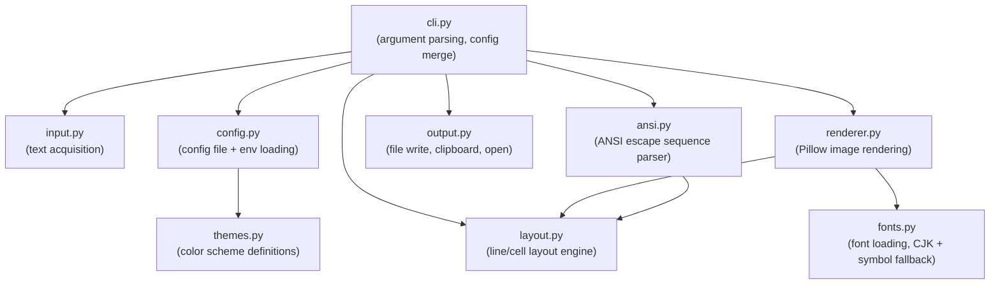
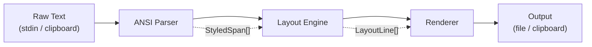
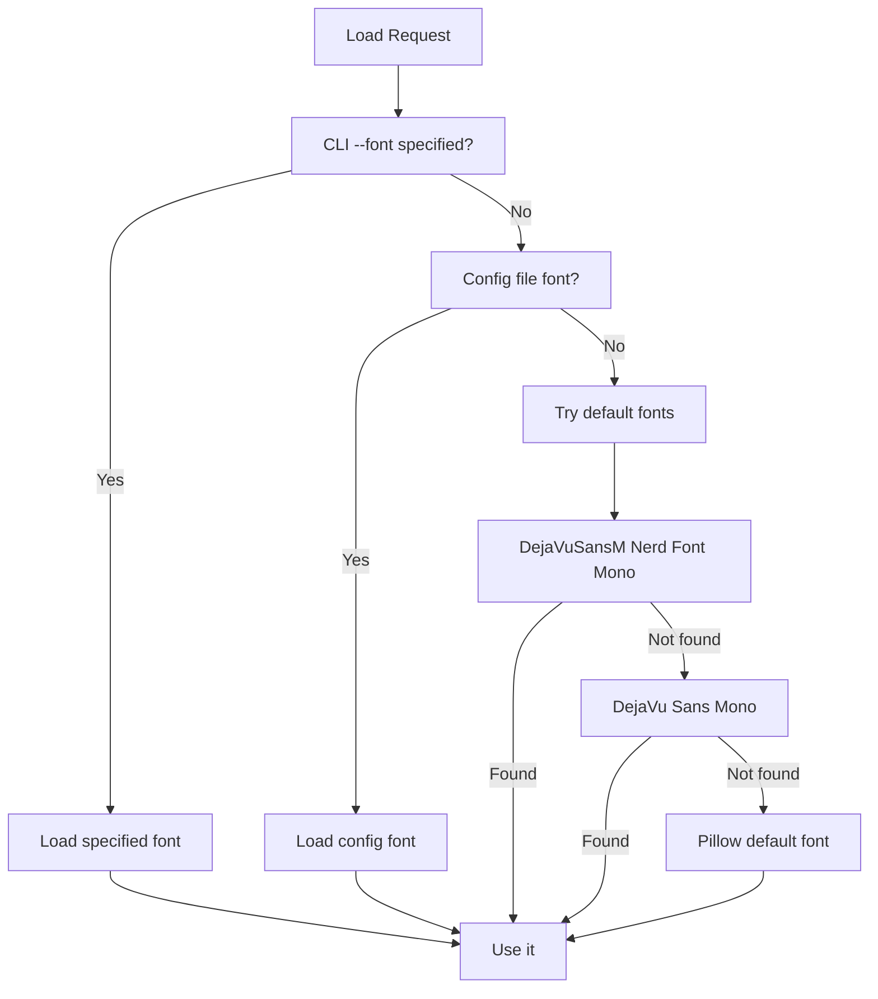

# tmux-shot Architecture & Design

## Overview

This document describes the architecture of tmux-shot after refactoring from a single-file script into a well-structured Python package. The design prioritizes simplicity, testability, and a clean rendering pipeline.

## Module Architecture



## Package Structure

```
tmux_shot/
    __init__.py          # version, public API
    __main__.py          # python -m tmux_shot entry point
    cli.py               # argparse, config merge, main()
    config.py            # config file loading (TOML)
    input.py             # stdin / clipboard text acquisition
    ansi.py              # ANSI SGR escape sequence parser
    layout.py            # text layout: lines, cells, dimensions
    fonts.py             # font loading, CJK + symbol fallback
    renderer.py          # Pillow-based image rendering
    themes.py            # built-in color schemes
    output.py            # file save, clipboard copy, open preview
    chrome.py            # optional window decorations (P1)
    py.typed             # PEP 561 marker
```

## Rendering Pipeline

The core pipeline transforms raw terminal text (potentially containing ANSI escape sequences) into a PNG image in five stages:



### Stage 1: Input Acquisition (`input.py`)

Responsible for obtaining the raw text to render.

**Sources (in priority order):**
1. **Stdin pipe** — detected via `sys.stdin.isatty()`
2. **System clipboard** — macOS: `pbpaste`, Linux: `xclip -o` / `xsel -o` / `wl-paste`
3. **tmux capture-pane** — `tmux capture-pane -p` (P1, for direct pane capture)

**Behavior:**
- Returns the raw byte string preserving ANSI escape codes
- Strips trailing whitespace / empty lines
- Raises `InputError` if no content is available

### Stage 2: ANSI Parser (`ansi.py`)

Parses ANSI SGR (Select Graphic Rendition) escape sequences and produces a list of styled text segments.

**Data model:**

```python
@dataclass
class Style:
    fg: Color | None = None       # foreground color
    bg: Color | None = None       # background color
    bold: bool = False
    dim: bool = False
    italic: bool = False
    underline: bool = False
    strikethrough: bool = False
    reverse: bool = False

Color = tuple[int, int, int]  # RGB

@dataclass
class StyledSpan:
    text: str          # the text content (no escape codes)
    style: Style       # applied style
```

**Supported SGR codes:**

| Code Range | Feature |
|------------|---------|
| 0 | Reset all attributes |
| 1, 2, 3, 4, 7, 9 | Bold, dim, italic, underline, reverse, strikethrough |
| 22, 23, 24, 27, 29 | Reset individual attributes |
| 30-37 | Standard foreground colors (8 colors) |
| 38;5;n | 256-color foreground |
| 38;2;r;g;b | 24-bit truecolor foreground |
| 39 | Default foreground |
| 40-47 | Standard background colors |
| 48;5;n | 256-color background |
| 48;2;r;g;b | 24-bit truecolor background |
| 49 | Default background |
| 90-97 | Bright foreground colors |
| 100-107 | Bright background colors |

**Parser approach:**
- Use a regex to split text on `\x1b\[[\d;]*m` boundaries
- Maintain a mutable `Style` state machine
- For each escape sequence, update the current style
- For each text segment, emit a `StyledSpan` with the current style snapshot
- Non-SGR escape sequences (cursor movement, etc.) are stripped

### Stage 3: Layout Engine (`layout.py`)

Computes the spatial layout of styled text as a grid of character cells.

**Data model:**

```python
@dataclass
class Cell:
    char: str               # single character
    style: Style            # style to apply
    display_width: int      # 1 for ASCII, 2 for CJK full-width

@dataclass
class LayoutLine:
    cells: list[Cell]
    total_width: int        # sum of display_width values

@dataclass
class LayoutResult:
    lines: list[LayoutLine]
    max_width: int          # maximum total_width across all lines
    total_lines: int
```

**Character width determination:**
- Uses `unicodedata.east_asian_width()`: `"F"` and `"W"` → width 2, all else → width 1
- Tab characters expanded to spaces (configurable tab width, default 8)
- Trailing empty lines stripped

**Canvas dimensions:**
```
image_width  = cell_width * max_width + padding * 2
image_height = line_height * total_lines + padding * 2
```

All values multiplied by `scale` factor for HiDPI rendering.

### Stage 4: Renderer (`renderer.py`)

Renders the layout into a Pillow `Image` object.

**Rendering strategy:**

```
For each LayoutLine:
    For each Cell in line:
        1. If cell has background color → draw filled rectangle
        2. Select font via select_for_char() (primary, style variant, or symbol fallback)
        3. Calculate x position = padding + cell_offset * cell_width
        4. For CJK chars: center within double-width cell
        5. Draw text with the cell's foreground color
        6. Apply decorations (underline, strikethrough) if needed
```

**Optimizations:**
- **Batch narrow runs**: consecutive narrow (width=1) characters with the same style AND same font are drawn in a single `draw.text()` call. The batch breaks when the font changes (e.g. primary → symbol fallback)
- **Skip empty lines**: lines with no content only advance the y cursor
- **Lazy font loading**: CJK and symbol fonts are loaded once at startup and cached

### Stage 5: Output (`output.py`)

Handles the final image disposition.

**File output:**
- Default path: `/tmp/tmux-shot-<YYYYMMDD-HHMMSS>.png`
- DPI metadata: `72 * scale` (so macOS Preview shows correct logical size)
- Print the output path to stdout

**Clipboard output** (`--clipboard`):
- macOS: `osascript -e 'set the clipboard to (read (POSIX file "...") as «class PNGf»)'`
- Linux: `xclip -selection clipboard -t image/png -i <file>` (P1)

**Auto-open** (`--open`):
- macOS: `open <file>`
- Linux: `xdg-open <file>` (P1)

## ANSI Color System

### Color Resolution Order

When rendering a cell's foreground/background color:

1. **Explicit RGB** — from 24-bit truecolor (`38;2;r;g;b`) → use directly
2. **256-color index** — from `38;5;n`:
   - 0-7: map to theme's standard 8 colors
   - 8-15: map to theme's bright 8 colors
   - 16-231: compute RGB from 6x6x6 color cube
   - 232-255: compute RGB from grayscale ramp
3. **Standard 16 colors** — from codes 30-37, 90-97 → map to theme palette
4. **Default** — use theme's `fg` / `bg` color

### Theme Structure

```python
@dataclass
class Theme:
    name: str
    bg: Color
    fg: Color
    palette: list[Color]   # 16 colors: 8 standard + 8 bright

    # Named access
    black: Color       # palette[0]
    red: Color         # palette[1]
    green: Color       # palette[2]
    yellow: Color      # palette[3]
    blue: Color        # palette[4]
    magenta: Color     # palette[5]
    cyan: Color        # palette[6]
    white: Color       # palette[7]
    # palette[8..15] = bright variants
```

### Built-in Themes

| Theme | Background | Foreground | Source |
|-------|-----------|-----------|--------|
| `one-half-dark` (default) | `#282c34` | `#dcdfe4` | Ghostty / VS Code |
| `one-half-light` | `#fafafa` | `#383a42` | Ghostty / VS Code |

Additional themes can be added via config file (P1).

## Font System

### Font Loading Strategy (`fonts.py`)



### CJK Fallback

When a character has `display_width == 2`, the renderer tries CJK fonts in order:

**macOS:**
1. `Hiragino Sans GB.ttc`
2. `STHeiti Medium.ttc`
3. `Songti.ttc`
4. `PingFang SC.ttc`

**Linux:**
1. `Noto Sans CJK SC`
2. `WenQuanYi Micro Hei`
3. `Droid Sans Fallback`

The CJK font is loaded once and cached for the duration of the render.

### Symbol Fallback

For Unicode symbols not covered by the primary font or CJK font (e.g. `U+23FA` BLACK CIRCLE FOR RECORD, `U+23BF`, `U+273B`), the renderer uses a **bitmap-hash tofu detection** mechanism:

1. Render the character with the primary font
2. Render a known-missing character (`U+FFFFF`) with the same font as a "tofu reference"
3. Compare bitmap hashes -- if identical, the character is tofu (missing glyph)
4. Fall back to the symbol font if tofu is detected

**Symbol font candidates:**

**macOS:**
1. `STIXTwoMath.otf`
2. `Apple Symbols.ttf`

**Linux:**
1. `STIXTwoMath.otf`
2. `DejaVu Sans.ttf`

**Implementation (`FontSet.select_for_char()`):**
- ASCII characters (`< 0x80`) always use the primary font (no fallback check)
- Non-ASCII characters are checked against the primary font using `_has_glyph()`
- Results are cached per `(font_id, char)` pair for performance
- The tofu reference hash is computed once per font and reused

### CJK Alignment

CJK characters are rendered centered within a double-width cell:

```
|-- cell_w --|-- cell_w --|
|    offset  |  CJK char  |  (char centered across 2 cells)
|<---------->|<---------->|
     padding   glyph_width
```

```
offset = (cell_w * 2 - glyph_actual_width) / 2
```

## Configuration System

### Priority Order (highest to lowest)

1. **CLI arguments** — e.g., `--font-size 14`
2. **Environment variables** — e.g., `TMUX_SHOT_FONT_SIZE=14`
3. **Config file** — `~/.config/tmux-shot/config.toml`
4. **Built-in defaults**

### Config File Format

```toml
# ~/.config/tmux-shot/config.toml

[general]
theme = "one-half-dark"    # or "one-half-light", or custom name
scale = 2
open = true                # always open after render

[font]
family = "DejaVuSansM Nerd Font Mono"
size = 16
line_height = 1.0

[layout]
padding = 20
tab_width = 8
# max_width = 120         # optional: wrap at column (P2)

[output]
directory = "/tmp"
clipboard = false
format = "png"             # "png" | "svg" (P1)

# [chrome]                 # P1: window decorations
# enabled = true
# style = "macos"          # "macos" | "none"
# title = ""

# [theme.custom-dark]      # P1: custom theme definition
# bg = "#1e1e2e"
# fg = "#cdd6f4"
# palette = ["#45475a", "#f38ba8", ...]
```

### Environment Variables

All config keys can be set via environment variables with the `TMUX_SHOT_` prefix:

| Variable | Equivalent Config |
|----------|------------------|
| `TMUX_SHOT_THEME` | `general.theme` |
| `TMUX_SHOT_SCALE` | `general.scale` |
| `TMUX_SHOT_FONT` | `font.family` |
| `TMUX_SHOT_FONT_SIZE` | `font.size` |
| `TMUX_SHOT_PADDING` | `layout.padding` |
| `TMUX_SHOT_OUTPUT_DIR` | `output.directory` |

## Terminal Integration

### tmux capture-pane Integration (Primary)

The primary tmux integration uses `capture-pane -e` to preserve ANSI escape sequences. A helper script `tmux-shot-capture` translates copy-mode selection coordinates into capture-pane line ranges.

```tmux
# ~/.tmux.conf

# Y in copy-mode: screenshot selection (preserving ANSI) + copy to clipboard
bind -T copy-mode-vi Y if-shell -F '#{selection_present}' \
  'run-shell -b "tmux-shot-capture #{selection_start_y} #{selection_end_y} #{history_size} --open --clipboard" ; \
   send-keys -X copy-pipe-and-cancel "pbcopy"' \
  'display-message "No selection"'
```

How it works:
1. User enters tmux copy-mode and selects text
2. Pressing `Y` triggers the binding -- tmux expands format variables while selection exists
3. `run-shell -b` launches `tmux-shot-capture` in the background (non-blocking)
4. `tmux-shot-capture` converts selection coordinates: `capture_line = selection_y - history_size`
5. `tmux capture-pane -e -p -S <start> -E <end>` captures content with ANSI codes preserved
6. Output is piped to `tmux-shot` for rendering
7. `copy-pipe-and-cancel` copies the plain text to clipboard and exits copy-mode

> **Why not `copy-pipe` alone?** `copy-pipe` sends plain text only, stripping all ANSI escape sequences. By using `capture-pane -e`, we preserve colors, bold, italic, and all terminal formatting.

> **Why `run-shell -b` before `copy-pipe-and-cancel`?** Format variables like `#{selection_start_y}` are expanded when tmux processes each command in the `;` chain. If `copy-pipe-and-cancel` runs first, it clears the selection -- making the format variables empty for subsequent commands. Placing `run-shell -b` first ensures the variables are captured while the selection still exists.

### Direct capture-pane

```bash
# Capture the entire visible pane
tmux capture-pane -p -e | tmux-shot --open

# Capture with scrollback (last 500 lines)
tmux capture-pane -p -e -S -500 | tmux-shot --open
```

### Other Terminals

tmux-shot works with any terminal via pipe:

```bash
# Any command output
ls --color=always | tmux-shot --open

# From clipboard
pbpaste | tmux-shot    # macOS
xclip -o | tmux-shot   # Linux
```

## Packaging & Distribution

### pyproject.toml

```toml
[build-system]
requires = ["hatchling"]
build-backend = "hatchling.build"

[project]
name = "tmux-shot"
version = "0.2.0"
description = "Render terminal text to PNG screenshots with ANSI color support"
requires-python = ">=3.10"
license = "MIT"
dependencies = [
    "Pillow>=10.0",
]

[project.optional-dependencies]
toml = ["tomli>=2.0; python_version < '3.11'"]  # tomllib is stdlib in 3.11+

[project.scripts]
tmux-shot = "tmux_shot.cli:main"
```

### Installation Methods

```bash
# PyPI (P0)
pip install tmux-shot
pipx install tmux-shot

# From source
git clone https://github.com/Async23/tmux-shot
cd tmux-shot
pip install -e .

# Homebrew formula (P1)
brew install tmux-shot
```

### Entry Points

- `tmux-shot` CLI command (via `[project.scripts]`)
- `python -m tmux_shot` (via `__main__.py`)

## Error Handling

| Error | Behavior |
|-------|----------|
| No input text | Print message to stderr, exit 1 |
| Font not found | Fall back to next candidate, warn to stderr |
| No CJK font | Render CJK chars with primary font (may look wrong), warn |
| Invalid ANSI sequence | Strip it silently (best-effort rendering) |
| Output path not writable | Print error to stderr, exit 1 |
| Clipboard command fails | Print warning to stderr, continue (image is still saved) |

## Testing Strategy

### Unit Tests

| Module | What to Test |
|--------|-------------|
| `ansi.py` | Parse SGR codes → correct `Style` attributes and `StyledSpan` output |
| `layout.py` | Character width calculation, line dimensions, tab expansion |
| `themes.py` | 256-color → RGB conversion, theme palette access |
| `config.py` | Config file parsing, CLI override, env var override |
| `fonts.py` | Font fallback chain (mock filesystem) |

### Integration Tests

- Render known ANSI input → compare output PNG against reference image (pixel diff)
- End-to-end: `echo "hello" | tmux-shot -o /tmp/test.png` → verify file exists and has expected dimensions

### CI

```yaml
# .github/workflows/test.yml
- Test on macOS and Ubuntu
- Python 3.10, 3.11, 3.12, 3.13
- Lint: ruff check + ruff format --check
- Type check: mypy (strict mode)
- Tests: pytest
```
